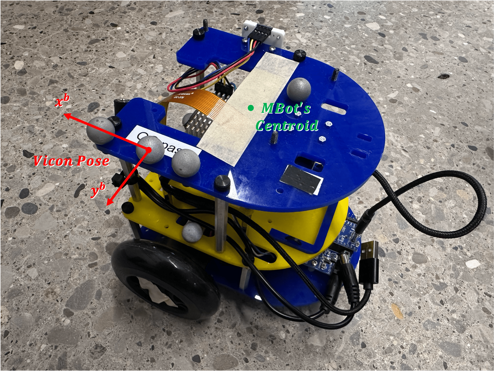
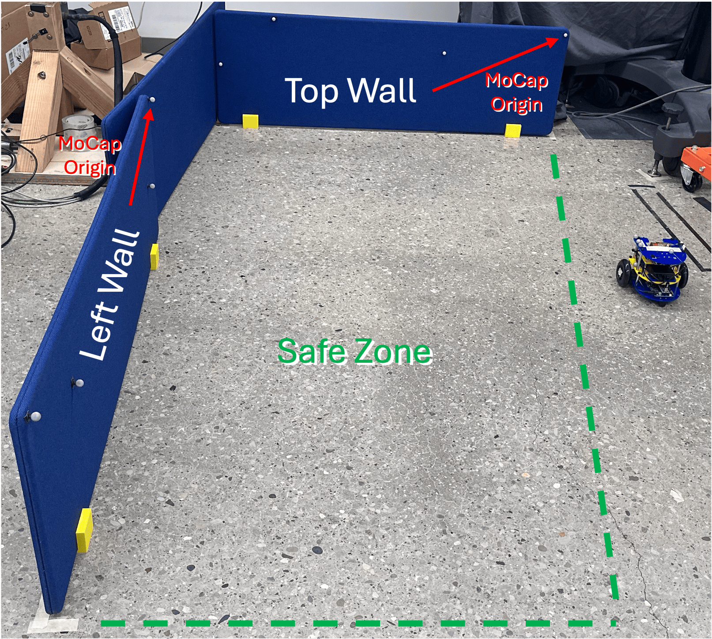

# MBot Experiments

This repo holds code for running data collection on the MBot platform.

## Setup

The `arm-mbot` hostname has been set in the Lab Router to have a fixed IP of `10.10.10.134`. If you give your robot a different hostname, modify the `ssh_config` file now. The web app will be available at: [http://10.10.10.134/](http://10.10.10.134/). Set `mbot` as the username, use the Lab's password, and setup to `ssid` to connect to the Lab's WiFi.

 Do NOT power on MBot without a properly formatted SD card. The OLED screen might take ~1 min to turn on. The [ARMLAB's fork](https://github.com/UM-ARM-Lab/mbot_lcm_base), in `external/mbot_lcm_base/`, sets LCM's TTL=1, instead of the default 0, allowing for other computers in the subnet to listen to the messages being published. You can now start the setup as per the [MBot's documentation](https://rob550-docs.github.io/docs/botlab/getting-started.html).


When done, setup an `ssh config` for the MBot using
```
cat ssh_config >> ~/.ssh/config
```
Check for existing ssh keys on your computer (e.g., `id_rsa.pub`) and if none are available generate one.
```
ls -al ~/.ssh
```
Then
```
ssh-copy-id -i ~/.ssh/id_rsa.pub mbot@10.10.10.134
```
From now, you can do `ssh arm-mbot`.

### Networking

Install LCM on your desktop. Then run
```bash
scp scritps/install_lcm_route.sh mbot@arm-mbot:~/mbot_ws/
ssh arm-mbot
cd ~/mbot_ws
chmod +x install_lcm_route.sh
./install_lcm_route.sh
```
so that the MBot's multicast goes out through the WiFi card (default is loopback). Continue the setup with

```bash
# Copy script to MBot
scp scripts/setup_mbot.sh mbot@arm-mbot:~/mbot_ws/

# SSH into MBot and run
ssh arm-mbot
cd ~/mbot_ws
chmod +x setup_mbot.sh
./setup_mbot.sh
```
and then
```bash
# Run on the desktop
./scripts/setup_desktop.sh
```

If the setup work, you should see the MBot's messages on the desktop's `lcm-spy`, e.g., odometry readings. You should also see the state and velocity from the vicon library on the MBot's `lcm-spy`. Remember to be on the same WiFi as the robot, i.e., `armlab`.

## Usage
To put into flashing mode: 1) on the control board, hold both "RST" and "BOOTSEL" 2) release "RST" first then "BOOTSELF".
To turn robot off, type `sudo shutdown now` in the terminal. Once lidar stops spinning, flick the switch of the power bank to OFF.

**Charging**: Plug the battery into the power supply and switch the battery to ON for charging. The power adapter will have a red light while charging, and it will turn green when done. Switch the battery to OFF for storage. Start charging once the powerbank drops to 3/5 bars. 

The Vicon SDK cannot run on the Raspberry Pi of the MBot (ARM architecture). The desktop will run a [Vicon 2 LCM bridge](https://github.com/UM-ARM-Lab/vicon2lcm), in `external/vicon2lcm/`. First see [How to setup MoCap objects](https://youtu.be/dGMwVMiX7-I?list=PLxtdgDam3USXPrhGA70ix8WT_nZBLK7qB). The hardcoded offset between the MoCap centroid's and the MBot's centroid (`config.py`) assumed you placed the Vicon's rigid body center following:



Use the other markers on the top plat to orient the body-frame axes. To define the drivable area, use the blue boards to setup a `left_wall` and `top_wall` as shown below:

Note where the origins of each body are (see arrows). The robot should stay within the rectangle defined by this drivable area. Place the walls so as to not block the MoCap system from seeing the MBot's markers.


### Calibration
Detects motor and encoder polarity and calibrates motor coefficients.
```bash
# First enter `flashing mode`
sudo mbot-upload-firmware flash mbot_calibrate_classic_v1.2.0_enc48.uf2
```
then to uploaded calibrated files
```bash
# Enter `flashing mode` again
sudo mbot-upload-firmware flash mbot_classic_v1.2.0_enc48.uf2
```

### Data Collection

Open at least three terminal windows:
```bash
cd external/vicon2lcm/
./build/lcm_vicon_bridge # To start Vicon Bridge
```

```bash
cd scripts
./start_robot_service.sh # ssh into MBot and starts OnboardController
```

```bash
cd scripts
./start_desktop_service.sh {sysID, full_dataset} # Starts the experiment monitor/logger/logic on the Desktop
```

Click the `Start Experiment` button when ready.
The Desktop monitor will automatically close upon experiment completion.
The Vicon Bridge and the Onboard Controller do not have to be restarted between experimental runs. 

## Notes on MBot


This repo was tested on the `Classic MBot` (differential drive with caster wheel), with encoder resolution of 48. This vehicle has DC motors, a custom "Robotics Control Board", RP Lidar, IMU, Raspberry Pi 5, and a Raspberry Pi Camera. For assembly instructions refer to the official documentation. LCM messages run on device at 25 Hz (although the control loop timing seems hacky, and you might see very different fluctuating rates through `lcm-spy`). As of August 2025, the ROS2 was still experiment, and hence LCM is used in this repo.

### Resources
- [mbot_bridge](https://github.com/mbot-project/mbot_bridge) is very high-level and underneath calls `mbot_autonomy` which calls `mbot_firmware`. It is used in ROB 102, but per Abishek should not really be used by us. [Explanation of use-cases](https://github.com/mbot-project/mbot_bridge/blob/main/docs/index.md).
- mbot_autonomy: No clear public-facing version (other than binaries).
- [mbot_firmware](https://github.com/mbot-project/mbot_firmware): Lowest level of available monitoring/control.
- [mbot_lcm_base](github.com/mbot-project/mbot_lcm_base): Contains LCM message definitions and tools for monitoring topics on the command-line.
- [mbot_sys_utils](https://github.com/mbot-project/mbot_sys_utils): Scripts and instructions for replicating the provided OS image for the Raspberry Pi. A subfolder indicates how to setup ROS2 on Ubuntu (regular code was tested on Debian 12).
- [mbot_ros2_ws](https://github.com/mbot-project/mbot_ros2_ws): Message definitions, URDF/xacro, and some configurations for using ROS2 on the MBot.
- [Standard Documentation](https://mbot.robotics.umich.edu/docs/)
- [ROB 550 Tutorials](https://rob550-docs.github.io/docs/botlab/)
- [mbot-project (GitHub Organization)](https://github.com/mbot-project)


### Troubleshooting

- Rebooting can help.
- It does not seem possible to control the robot prior to the first calibration.
- LCM appears to be required for the `mbot_brige` and web-server applications.
- [Robot is Driving Crooked](https://mbot.robotics.umich.edu/docs/troubleshooting/#my-robot-is-driving-crooked)
- Git clone through https on the MBot to avoid having to setup personal keys (if only pulling and not pushing).


